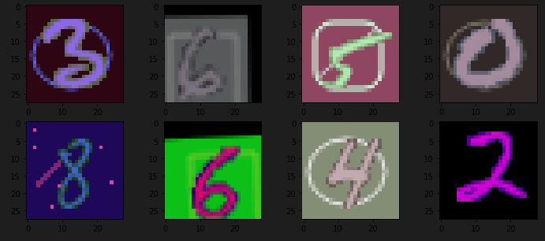

# MNIST_Challenge


you can test codes by running
``` bash
python3 run_lenet5.py
..or
python3 run_Vgg.py
```


Data Augmentation jupyter
``` bash
cd for_training/
code data_Augment.ipynb
```

example images...

